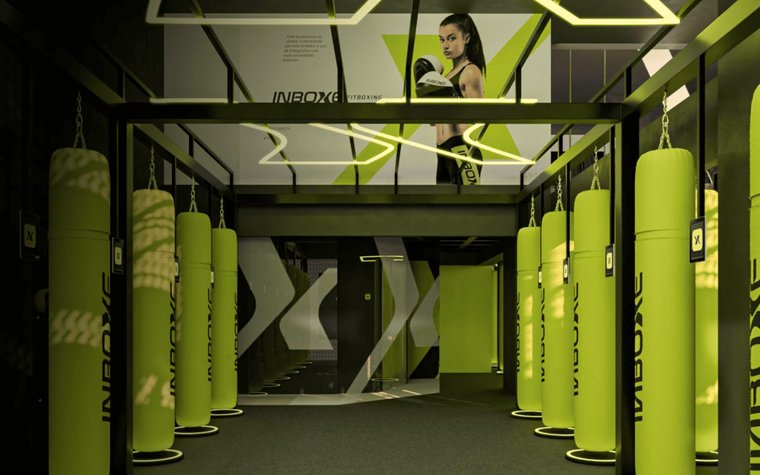
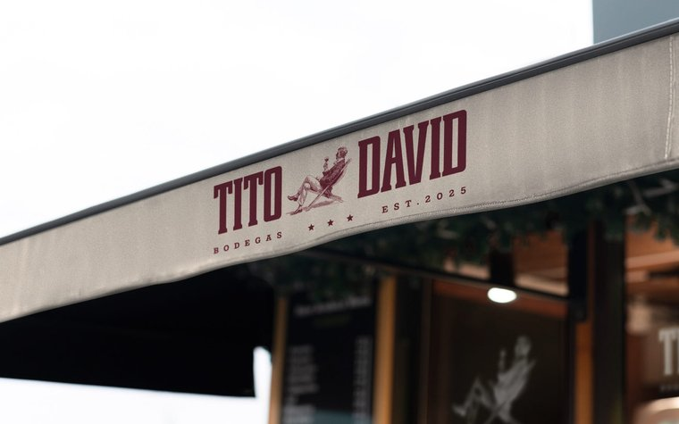
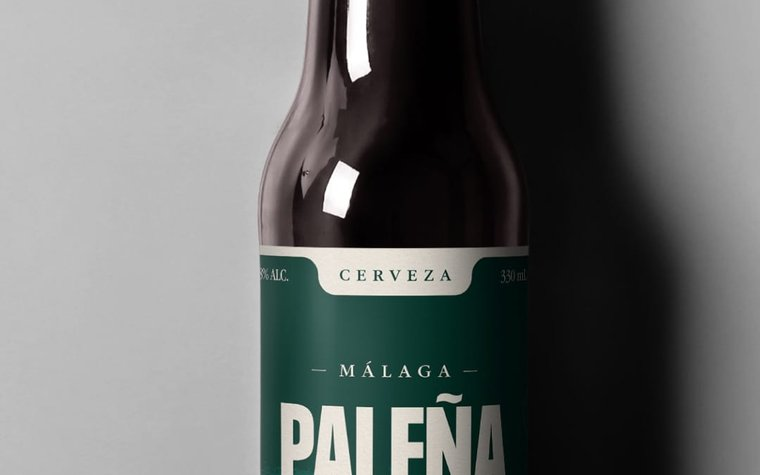
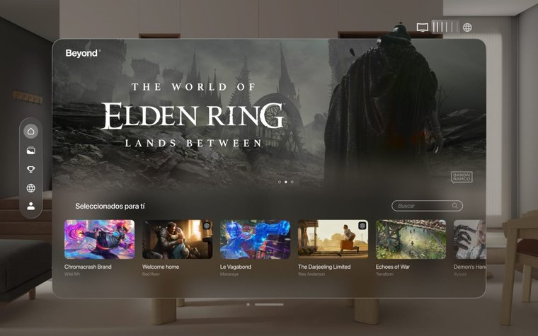

  

  <a href="https://oddxandre.github.io/Portfolio_OddXandre"><strong>Sitio en vivo →</strong></a> ·
  <a href="media/PedroCarreras_UXUI_VisualDesigner.pdf"><strong>CV en PDF</strong></a> ·
  <a href="mailto:oddxandre@gmail.com">oddxandre@gmail.com</a>

  Convierto problemas complejos en productos claros: 
  investigación, interfaces y sistemas de diseño que escalan.

## Proyectos

| | |
|:---:|:---:|
|  <strong>Inboxe Fitboxing</strong> Producto digital · BeByte · 2026 |  <strong>Tito David</strong> Branding & packaging · 2026 |
|  <strong>Cerveza Paleña</strong> Identidad visual · 2025 |  <strong>Beyond Frames</strong> Apple Vision Pro · EASD San Telmo · 2024 |

  <a href="https://oddxandre.github.io/Portfolio_OddXandre/work.html">Ver los 8 proyectos →</a>

  

  

---

  Construido a mano: HTML · CSS · JavaScript · GSAP — sin plantillas.

