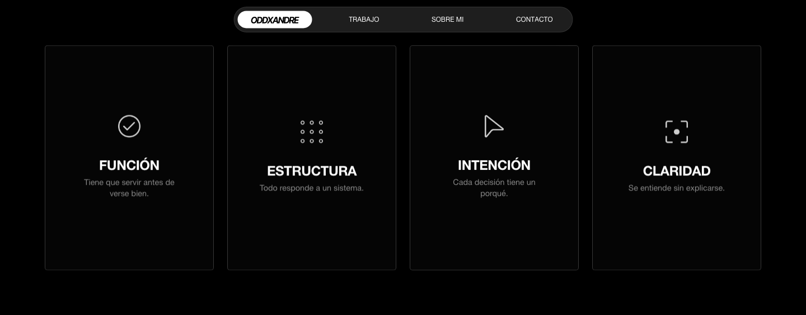
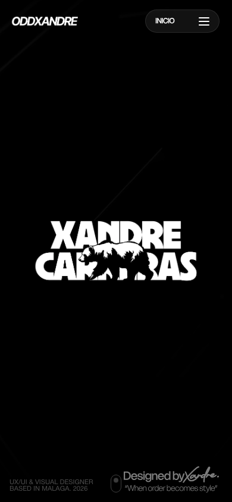

# OddXandre

**UX/UI & Visual Designer** · Málaga, España

---

Portfolio profesional de **Xandre Carreras (OddXandre)**. Diseño producto digital, branding estratégico, interfaces web y móviles, y sistemas de diseño con un enfoque centrado en la experiencia de usuario, la calidad estética y el propósito de marca.

---

## Proyectos destacados

| Proyecto | Tipo | Cliente | Año |
|---|---|---|---|
| [Tito David](https://oddxandre.github.io/Portfolio_OddXandre/project-tito-david.html) | Branding & Packaging | Independiente | 2026 |
| [Inboxe Fitboxing](https://oddxandre.github.io/Portfolio_OddXandre/project-inboxe.html) | UX/UI & Product Design | BeByte | 2026 |
| [Cerveza Paleña](https://oddxandre.github.io/Portfolio_OddXandre/project-palena.html) | Identidad Visual | Independiente | 2025 |
| [Beyond Frames](https://oddxandre.github.io/Portfolio_OddXandre/project-beyond-frames.html) | Apple Vision Pro Concept | EASD San Telmo | 2024 |
| [Copao](https://oddxandre.github.io/Portfolio_OddXandre/project-copao.html) | Campaña Salud Mental | Credo | 2024 |
| [Aguas de Benahavís](https://oddxandre.github.io/Portfolio_OddXandre/project-benahavis.html) | Campaña Branding | Credo | 2024 |
| [Infoca](https://oddxandre.github.io/Portfolio_OddXandre/project-infoca.html) | Campaña Conciencia Ambiental | Credo | 2024 |
| [Nook](https://oddxandre.github.io/Portfolio_OddXandre/project-nook.html) | App Productividad Contextual | EASD San Telmo | 2023 |

### Vista previa

  

  

  

  

  

## Servicios de diseño

- **UX/UI Design** — Interfaces web y móviles, prototipado interactivo, investigación de usuarios, arquitectura de información
- **Branding Estratégico** — Identidad visual, naming, guías de marca, posicionamiento
- **Diseño Visual** — Sistemas visuales, diseño editorial, diseño gráfico corporativo
- **Diseño de Producto Digital** — Producto desde cero, rediseños, diseño de features
- **Design Systems** — Sistemas de diseño escalables, documentación de componentes, tokens
- **Consultoría UX** — Auditorías de experiencia de usuario, optimización de conversión

## Experiencia profesional

| Rol | Empresa | Periodo |
|---|---|---|
| Product & UX/UI Designer | BeByte S.L. | Abr 2025 — Sep 2025 |
| UX/UI, Visual & Multimedia Designer | Credo.si | Ene 2024 — Dic 2024 |
| UX/UI & Visual Designer | Impar.ux | Jun 2022 — Sep 2024 |

## Herramientas

Figma · Adobe Photoshop · Illustrator · InDesign · After Effects · Premiere Pro · Framer · Notion · GSAP · Vite · HTML5 · CSS3 · JavaScript · AI-assisted design

## Filosofía de diseño

Diseño con intención, no con adornos. Lo visual y lo funcional van juntos o no van. Sistemas claros, experiencias que se entienden solas y una presencia visual que no necesita gritar.

## Preguntas frecuentes

### ¿Qué servicios de diseño UX/UI ofreces?
Diseño de interfaces web y móviles, branding estratégico, diseño de producto digital, sistemas de diseño y consultoría UX. Cada proyecto se adapta a las necesidades del cliente.

### ¿Dónde estás basado?
Málaga, Andalucía, España. Trabajo tanto de forma remota con clientes de toda España y Europa como presencialmente.

### ¿Cuánto cuesta contratar a un diseñador UX/UI?
Cada proyecto es diferente. Trabajo con presupuestos personalizados según alcance y complejidad.

### ¿Cómo puedo solicitar un presupuesto?
A través del formulario de contacto en [oddxandre.github.io/Portfolio_OddXandre](https://oddxandre.github.io/Portfolio_OddXandre/contact.html) o por email a oddxandre@gmail.com.

---

## Tecnologías del portfolio

**GSAP** — Animaciones de alto rendimiento · **Vite** — Build tool rápida · **Vanilla JS** — JavaScript nativo · **CSS3** — Estilos avanzados y responsive design · **HTML5** — Marcado semántico

---

## Contacto

- **Email** — [oddxandre@gmail.com](mailto:oddxandre@gmail.com)
- **LinkedIn** — [linkedin.com/in/xvndre](https://es.linkedin.com/in/xvndre)
- **Instagram** — [@oddxandre](https://www.instagram.com/oddxandre/)
- **Web** — [oddxandre.github.io/Portfolio_OddXandre](https://oddxandre.github.io/Portfolio_OddXandre)
