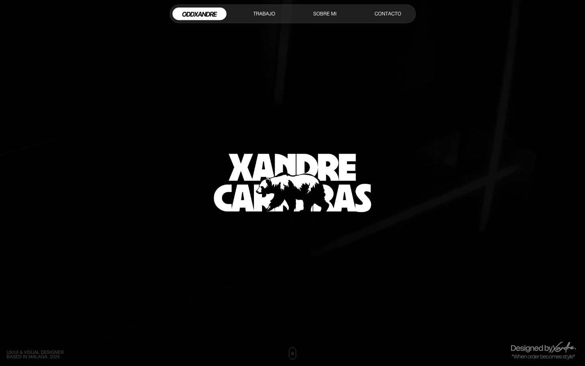
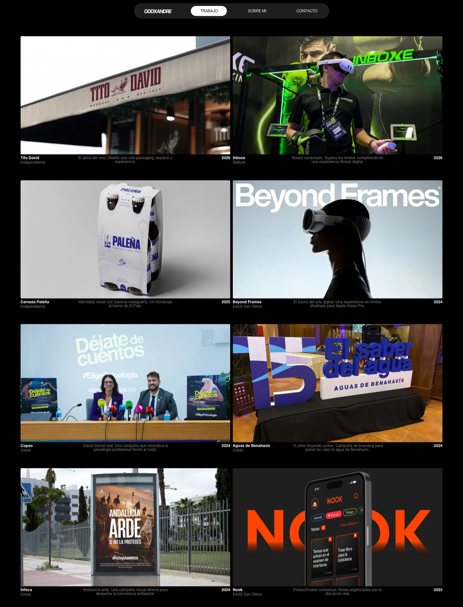
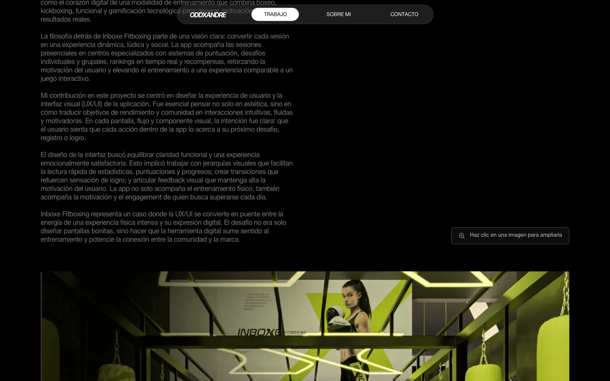

  

# OddXandre — Portfolio

Product & UX/UI Designer · Málaga, España

**[Ver en vivo →](https://oddxandre.github.io/Portfolio_OddXandre)** · [CV en PDF](media/PedroCarreras_UXUI_VisualDesigner.pdf) · oddxandre@gmail.com

Convierto problemas complejos en productos claros: investigación, interfaces y sistemas de diseño que escalan.

  

## Proyectos

| Proyecto | Tipo | Cliente | Año |
|---|---|---|---|
| [Inboxe Fitboxing](https://oddxandre.github.io/Portfolio_OddXandre/project-inboxe.html) | Producto digital | BeByte | 2026 |
| [Tito David](https://oddxandre.github.io/Portfolio_OddXandre/project-tito-david.html) | Branding & packaging | — | 2026 |
| [Cerveza Paleña](https://oddxandre.github.io/Portfolio_OddXandre/project-palena.html) | Identidad visual | — | 2025 |
| [Beyond Frames](https://oddxandre.github.io/Portfolio_OddXandre/project-beyond-frames.html) | Apple Vision Pro | EASD San Telmo | 2024 |

**[Ver los 8 proyectos →](https://oddxandre.github.io/Portfolio_OddXandre/work.html)** — incluye Copao, Benahavís, Infoca y Nook (Credo · EASD San Telmo).

  

  

---

Construido a mano: HTML · CSS · JavaScript · GSAP — sin plantillas.
